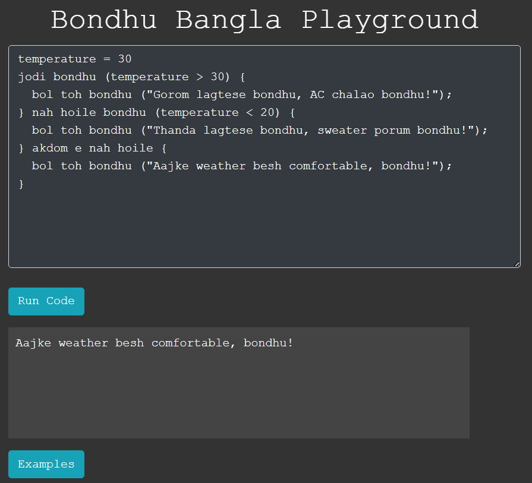

# BondhuLang
 

## Output 

```py
bol toh bondhu ("kire bondhu!");
```
## Variable
```py
bondhu aida hoilo day = "Sunday";
bondhu aida hoilo temperature = 25;
bondhu aida hoilo isSunny = haw bondhu;
bondhu aida hoilo counter = 0;
```
## Types
```py
 bondhu aida hoilo a = 10;
 bondhu aida hoilo b = 10 + (15*20);
 bondhu aida hoilo c = "duita";
 bondhu aida hoilo d = 'acha thikasey';
 bondhu aida hoilo e = kisuina bondhu;
 bondhu aida hoilo f = haw bondhu;
 bondhu aida hoilo g = nah bondhu;
```
## Example
```py
bondhu aida hoilo manushJon = 5;
bondhu aida hoilo koiGhontaKoraLagbe = 8;
bondhu aida hoilo shobMilayaKotoKhonLagbe = manushJon * koiGhontaKoraLagbe;
bol toh bondhu("Shob miliya koto ghonta kamla khatesi amra hoilo = " + shobMilayaKotoKhonLagbe);
 ```
## Conditional
```py
temperature = 30
jodi bondhu (temperature > 30) {
  bol toh bondhu ("Gorom lagtese bondhu, AC chalao bondhu!");
} nah hoile bondhu (temperature < 20) {
  bol toh bondhu ("Thanda lagtese bondhu, sweater porum bondhu!");
} akdom e nah hoile {
  bol toh bondhu ("Aajke weather besh comfortable, bondhu!");
}
 ```
## Loop
```py
bondhu aida hoilo a = 0;
  jotokhon porjonto bondhu (a < 10) {
   a += 1;
   jodi bondhu (a == 5) {
    bol toh bondhu("loop er bhitor theke boltesi bondhu ", a);
    tarpor er tah dekh bondhu;
   }
   jodi bondhu (a == 6) {
    thamis bondhu;
   }
   bol toh bondhu(a);
  }
  bol toh bondhu("done");
 ```
## Function
```py
bondhu kam da hoilo jog(a,b){
    de toh bondhu (a+b);
}
bol toh bondhu(jog(5,7))
 ```
## Example
```py
bondhu kam da hoilo multiply(x, y) {
    de toh bondhu (x * y);
}

bondhu aida hoilo result = multiply(3, 4);
bol toh bondhu("The result is: " + result);
 ```

